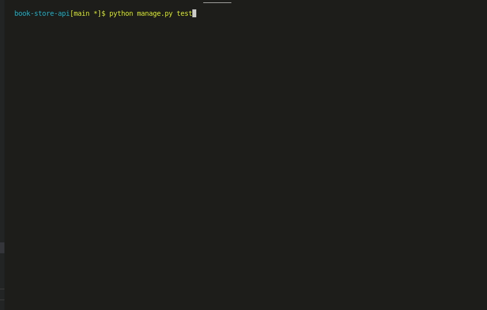

# book-store-api

**Author**: Wesam Al-Masri
**Version**: 1.0.0

## Overview

RESTful API server for a books share application with various features and in which the users can be registered to get access to books that has been published by authors.
The users can make an author's account to have the ability to share their own books or content.

## Getting Started

1. Fork the repo then clone it using git clone `<your forked repos link>`.
2. Install all the needs packages by npm install.
3. Create a .env file to store the virtual environment in the root directory, then add the following variables:
    - `DEBUG = True`: Debug mode.
    - `SECRET_KEY="App secret key"`
    - `S3_BUCKET_URL`, `AWS_S3_ACCESS_KEY_ID`, `AWS_S3_SECRET_ACCESS_KEY`, `AWS_STORAGE_BUCKET_NAME`, `AWS_HOST_REGION` From your S3 AWS account.
4. Create a super user by running this command to the terminal `python manage.pu createsuperuser`, it will ask you for a username and password.
5. Run the server by entering the command `python manage.py runserver`.

## Database Model Diagram

## Features & Routes

### Users and Profile

#### Auth

| Method | Endpoint    | Description                           |
| ------ | ----------- | ------------------------------------- |
| POST   | `/login`    | Login the user                        |
| POST   | `/register` | Register a new user                   |
| POST   | `/refresh`  | Get a new access token                |
| GEt    | `/me`       | Get information about the logged user |
| GEt    | `/logout`   | Logout the user                       |

#### User Profile

| Method | Endpoint       | Description                             |
| ------ | -------------- | --------------------------------------- |
| Get    | `/profile`     | Get a list of all profiles information  |
| Get    | `/profile/:id` | Get a profile's information with the id |
| POST   | `/profile`     | Create a new profile for a user         |
| PUT    | `/profile/:id` | Update profile's information            |

#### File Upload

| Method | Endpoint       | Description       |
| ------ | -------------- | ----------------- |
| Post   | `/file-upload` | Upload a new file |

### Store

#### Categories

| Method | Endpoint       | Description                  |
| ------ | -------------- | ---------------------------- |
| Get    | `/file-upload` | Get a list of all categories |

#### Authers

| Method | Endpoint       | Description                        |
| ------ | -------------- | ---------------------------------- |
| POST   | `/authers`     | Create an auther account to a user |
| PUT    | `/authers`     | Update auther information          |
| GET    | `/authers`     | Get a list of authers              |
| GET    | `/authers/:id` | Get auther information with the id |

#### Book

| Method | Endpoint    | Description                        |
| ------ | ----------- | ---------------------------------- |
| POST   | `/book`     | Create and upload a book           |
| PUT    | `/book`     | Update book information            |
| GET    | `/book`     | Get a list of books available      |
| GET    | `/book/:id` | Get a book information with the id |
| DELTE  | `/book/:id` | Delete a book with the id          |

#### Book Image

| Method | Endpoint          | Description                     |
| ------ | ----------------- | ------------------------------- |
| POST   | `/book-image`     | Create and upload a book image  |
| PUT    | `/book-image`     | Update book image               |
| GET    | `/book-image/:id` | Get a book image with the id    |
| DELTE  | `/book-image/:id` | Delete a book image with the id |

#### book-comment

| Method | Endpoint            | Description                           |
| ------ | ------------------- | ------------------------------------- |
| POST   | `/book-comment`     | Create a comment to a book by a user  |
| PUT    | `/book-comment`     | Update a comment to a book by a user  |
| GET    | `/book-comment`     | Get a alist of all comments to a book |
| GET    | `/book-comment/:id` | Get a comment to a book               |
| DELTE  | `/book-comment/:id` | Deletea comment to a book with the id |

## Test

## Technology

)

